<div align="center">


# BhashaBridge V4

### Offline, on-device English ⇄ Hindi translation, tuned to the Arm CPU in your phone

*No server. No network permission. No data leaving the device.*

[](https://github.com/pareshvpk/BhashaBridge---ARM-AI-Optimization/releases/download/v4.0/BhashaBridge-v4-arm64.apk)
[](docs/media/demo.mp4)
[](docs/submission/PROJECT_WRITEUP.md)


<table>
<tr>
<td align="center" width="150"><h2>⚡ 412.8</h2><b>tok/s peak</b><br><sub>Snapdragon 8 Elite Gen 5</sub></td>
<td align="center" width="150"><h2>🚀 2.12×</h2><b>faster decode</b><br><sub>vs. the un-cached lineage</sub></td>
<td align="center" width="150"><h2>🗜️ 3.96×</h2><b>smaller weights</b><br><sub>1869 → 472 MB, INT8</sub></td>
<td align="center" width="150"><h2>📵 0</h2><b>network permissions</b><br><sub>enforced by the manifest</sub></td>
</tr>
</table>

</div>

**Jump to:** [📖 What it is](#-what-bhashabridge-is) · [🧠 What makes it different](#-what-makes-it-different) ·
[📊 Evidence](#-evidence-at-a-glance) · [✨ Features](#-features) · [📱 Screenshots](#-screenshots) ·
[📈 Benchmarks](#-where-the-speed-up-comes-from) · [🕸️ v3.4.1 vs V4 vs iPhone](#️-three-way-comparison-v341-vs-v4-vs-iphone) ·
[🔬 KleidiAI & EPs](#-kleidiai--the-execution-providers) ·
[🍎 Android vs iOS](#-cross-platform-android-and-ios) · [🚀 Get started](#-get-started) ·
[🗂️ Repo guide](#️-repository-guide) · [📚 Docs](#-documentation) · [⚠️ Limitations](#️-known-limitations) ·
[🧾 Why trust it](#-why-trust-any-of-this) · [⚖️ License](#️-license)

---

## 📖 What BhashaBridge is

A private translator that works when the network doesn't. It runs a **distilled IndicTrans2 200M translation
model and an on-device speech pipeline** entirely on the phone's Arm CPU — type or speak in either language,
with the radio switched off. The offline guarantee isn't a settings toggle: the app declares **no `INTERNET`
permission at all**, so Android itself enforces it.

<p align="center">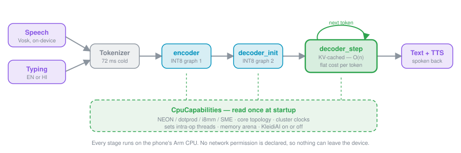</p>

The engineering story is that runtime. A transformer decoder that shipped with **no KV cache** was
re-exported into the three-graph cached pipeline above, quantized to INT8 behind a numeric parity gate, and
made **Arm-capability-aware** — every step backed by on-device measurement across **twelve devices, from
Armv8.0 to ARMv9**. Ships for **arm64 Android (API 24+)**, validated on Android 12 → 16 across nine devices
and four silicon vendors, then independently ported and re-measured on iOS.

---

## 🧠 What makes it different

| Runtime decision | What BhashaBridge does |
|---|---|
| **CPU backend dispatch** | Reads `/proc/cpuinfo` HWCAP + cpufreq at startup. The same INT8 model dispatches a different integer kernel per silicon: plain NEON → MLAS dot-product (SDOT/UDOT) → MLAS i8mm → **KleidiAI's SME kernel**. Chosen at runtime, no recompile. |
| **KV-cache export** | The upstream ONNX export dropped the decoder's key/value cache, making decode **O(n²)**. BhashaBridge hand-builds a three-graph export (`encoder` / `decoder_init` / `decoder_step`) with the attention cache flattened to named ONNX ports — **O(n)**, flat per-step cost. |
| **Thread policy** | Derives intra-op threads from CPU topology (`perfCores / 2`, clamped `[1,2]`) rather than hard-coding. These INT8 GEMMs are latency-bound, so over-threading *regresses*; the clamp's upper bound is the one value ever measured, and it was measured as a loss. |
| **KleidiAI advisor** | KleidiAI's 8-bit kernels are reachable only on SME cores. BhashaBridge confirms at the instruction level whether SME actually runs (`simpleperf`), then sets its policy by measurement — **off on the Android SME part (−8.9%), on for iOS (+3–9%).** |
| **Execution-provider probe** | Doesn't assume. Counts node placement: XNNPACK claims **0 nodes** (folds to MLAS); the NPU/NNAPI path runs **2.3× slower**. Ships the tuned CPU path deliberately. |
| **Memory arena** | CPU arena **off** — process memory 983 → 617 MB (−38%) at no latency cost on this latency-bound workload. |
| **Verified quantization** | INT8 export is gated by seven numeric checks; greedy token sequences must be **identical to fp32** before any device integration. |
| **Live telemetry** | A top-right in-app panel shows the running engine's tokens · ms · tok/s, thread policy, and detected CPU — reading the live runtime, so it cannot drift from what is executing. |

BhashaBridge does not claim to beat a hand-tuned desktop export on raw token rate. Its purpose is to give a
normal phone user a correct, private translation in under a tenth of a second on modern silicon, with the
hardware-aware decisions made for them and the evidence in the box.

---

## 📊 Evidence at a glance

Every number below is measured on the phone and bounded. Where the project's own ablation disproved one of
its earlier claims, that is recorded here rather than buried (see [Why trust any of this](#-why-trust-any-of-this)).

### 📶 One APK, the whole Arm ISA range — 8.2× from oldest to newest

<p align="center">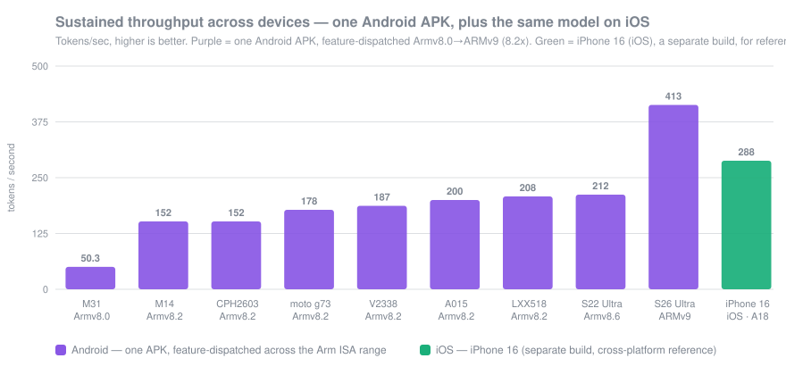</p>

Nine Android devices, four silicon vendors, **one binary**: MLAS feature-dispatches the INT8 kernel at
runtime, so the Armv8.0 part (plain NEON) and the ARMv9 part (SVE2/SME) run the same file. The two throttled
runs (CPH2603, S22U) are lower bounds, and the S22U additionally ran single-threaded — see the caveats in
[the cross-device report](bench/results/cross-device/CROSS_DEVICE_REPORT.md).

The three that matter most:

| | Claim | The number |
|---|---|---|
| 🧮 | The rewrite changed the **complexity class**, not a constant | 12-token decode **2.12× faster**, per-token rate rises instead of falling |
| 🔬 | KleidiAI's SME kernel runs — and the app **turns it off anyway**, by measurement | forcing it on costs **−8.9%** on Android, wins **+3–9%** on iOS |
| ✅ | INT8 quantization changed the **output not at all** | greedy tokens identical to fp32, weights **3.96× smaller** |

<details>
<summary><b>📋 All nine claims, each with the boundary it holds inside — click to expand</b></summary>

<br>

| Claim | Evidence | Boundary |
|---|---|---|
| **The rewrite changed the complexity class, not just a constant** | The upstream export re-attended the whole prefix each step (O(n²)); the three-graph cache is O(n). Per-token throughput goes from **falling** (13.9 → 9.5 tok/s) to **rising** (14.9 → 21.6). On the 12-token sentence, **2.12× faster decode** on identical hardware. | Apples-to-apples on one device (SM-M315F). Widens with length — not a fixed multiplier. |
| **The same APK scales across the whole Arm ISA range, no recompile** | **50.3 → 412.8 tok/s** from Armv8.0 (Exynos 9611) to ARMv9 (Snapdragon 8 Elite Gen 5), nine Android devices, four vendors, feature-dispatched at runtime by MLAS. | Throughput moves with thermal + thread count; the flagship figure is a cool, multithreaded run, not a universal number. |
| **KleidiAI's SME kernel executes — and the app disables it anyway, by measurement** | `simpleperf` shows the single hottest loop in the app (21.7% of ORT time) is KleidiAI's `smopa` signed-8-bit SME kernel. Forcing it **on** costs **−8.9%** on the Android SME part, so the policy sets `disableKleidiAi = caps.sme`. | Platform-dependent: on **iOS** the same kernel is a **+3–9% win**, so the policy flips per build. |
| **The alternate execution providers were probed and rejected** | Node-placement counts: XNNPACK assigns **0 nodes** (byte-identical placement to CPU → it *is* MLAS); the NNAPI/NPU path runs **2.3× slower**. | Two devices; a property of the export (hot GEMMs are `com.microsoft` contrib ops), confirmed on a second SoC. |
| **Quantization to INT8 did not change the output** | Greedy token sequences **identical to the fp32 reference**, max logit delta 0.448. Weights **1869 MB → 472 MB (3.96×)**. | Greedy/argmax equivalence, not bit-exactness. |
| **Startup dropped 5.3×, and the model was never the bottleneck** | Engine-ready **27,000 → ~5,100 ms**. Of the original startup, ~49% was a character-at-a-time JSON parser and ~46% was ORT building sessions; unpacking 472 MB of assets was 1.8 s, once. | Measured on the baseline device; cold start is IO + one-time-compute bound. |
| **A correctness defect both versions shipped, only V4 fixed** | A fixed 18-step cap silently truncated long inputs: **5 / 16 sentences (31%)**. The length-derived cap fixes it → **0 / 16**. | 16 sentences, real engine, one device. |
| **The thread count earns the speed; over-threading regresses** | Intra-op clamped `[1,2]`; monotonic degradation above 2 on the 8-core flagship — `intra8` = 153 ms vs `intra2` = 91 ms. | Per-topology; only the uniform 8-core flagship even derives >2 before the clamp. |
| **Ship both directions in less space than the old version used for one pair** | The KV-cache split *looked* like +283 MB; hashing showed duplicated decoder weights. Pointing both graphs at one content-addressed blob took the APK **894 → 617 MB (−31%)**, output bit-identical. | Device steady-state storage is unchanged; the win is in the APK and download. |

</details>

**[docs/Benchmarks.md](docs/Benchmarks.md)** has the full record, the graphs, and the limits;
**[docs/Comparison.md](docs/Comparison.md)** is the measured v3.4.1 → V4 delta.

---

## ✨ Features

| | Feature | |
|---|---|---|
| 💬 | **Offline translation** | English ⇄ Hindi, both directions, from verified cached INT8 graphs |
| 🎙️ | **Live speech** | Vosk recognition with a running waveform, streaming translation of partials, spoken output via system TTS — the recognizer runs **5.25× faster than the speech itself** on a flagship |
| 🚨 | **Emergency phrases** | 32 human-translated pairs, four categories, instant — no model on the path |
| 📂 | **Audio import** | Transcribe and translate a recorded file via the Storage Access Framework (no storage permission) |
| 📟 | **Live telemetry** | Top-right panel: tokens · ms · tok/s of the last translation, the ORT policy in force, the detected CPU |
| 🧪 | **Arm Smoke Test** | Standalone benchmark app: preset dial (Light → Torture), KleidiAI A/B, thread sweep, per-graph timings, thermal + energy telemetry, one-tap **CSV/JSON export** (`bb-bench/1`) |
| 🌐 | **Bilingual UI** | App language English / हिंदी, plus history and a Model & device panel |
| 🎨 | **Polish** | Streaming output with Stop / New / Copy, Markdown-clean rendering, light / dark / system themes |

---

## 📱 Screenshots

Captured on a Snapdragon 6 Gen 1 phone (ARMv8.2, dotprod, no i8mm/SME), offline:

| Translate — live metrics | In-app stats panel | Model & device |
|---|---|---|
| 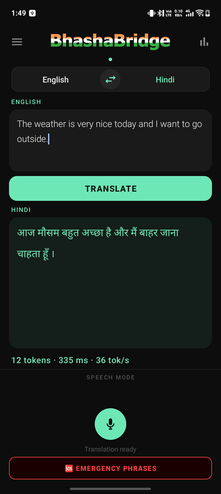 | 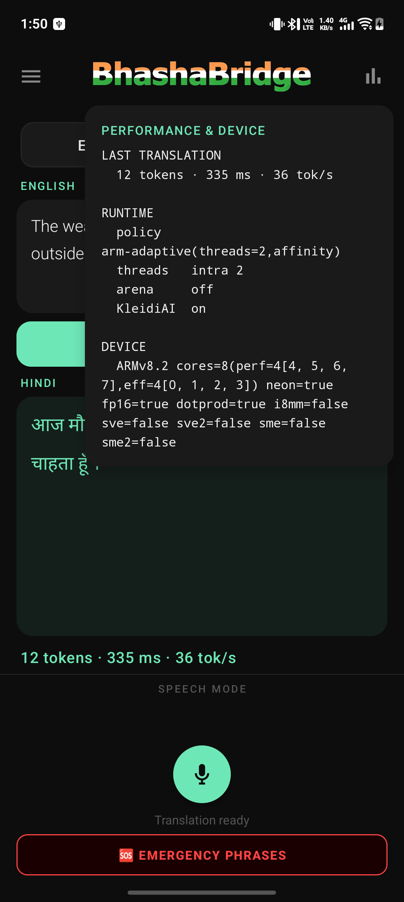 | 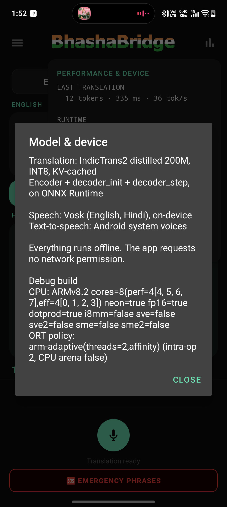 |

The **stats panel** (top-right toggle) reads the running engine: the last translation's
`12 tokens · 335 ms · 36 tok/s`, the ORT policy in force (`arm-adaptive(threads=2)`, arena off,
KleidiAI), and the detected CPU capabilities — so an on-screen number is the number that executed.

---

## 📟 In-app metrics & benchmark

Two views of the same engine — and the benchmark **compiles the app's own inference sources** (a mirror,
never a fork), so its numbers come from the exact engine the product runs.

| | Where | What it reports |
|---|---|---|
| 📟 | **In the translator** | The last translation live — `12 tokens · 86 ms · 140 tok/s` — plus the running policy (`arm-adaptive(threads=2,noKleidiAI)`) and the detected CPU |
| 🧪 | **In the Arm Smoke Test** | A PP-512 / TG-128 pass on an unplugged, thermally-settled phone: translation latency, per-graph cost, a KleidiAI A/B, CPU-throughput scaling — every pass exportable |

Representative mid-range pass: **716 ms / translation · 16 → 12 tokens · 16.8 tok/s**; encoder 90 ms,
`decoder_init` 59 ms, `decoder_step` 46 ms/tok; int8 dot-product **200.9M → 460.8M op/s** across the fast cluster.

---

## 📈 Where the speed-up comes from

The current benchmark of record re-runs the earlier version's own INT8 graphs through the new harness, so the
comparison is apples-to-apples rather than marketing. Translation latency, EN→HI, `MtBenchmarkTest`, medians:

| Sentence | Tokens | v3.4.1 lineage (int8, no cache) | V4 | Speed-up |
|---|---|---|---|---|
| "Water." | 2 | 184.5 ms | **166.4 ms** | 1.11× |
| "Hello, how are you?" | 6 | 526.4 ms | **350.0 ms** | 1.50× |
| "The weather is very nice today…" | 12 | 1353.6 ms | **640.1 ms** | **2.11×** |

<p align="center">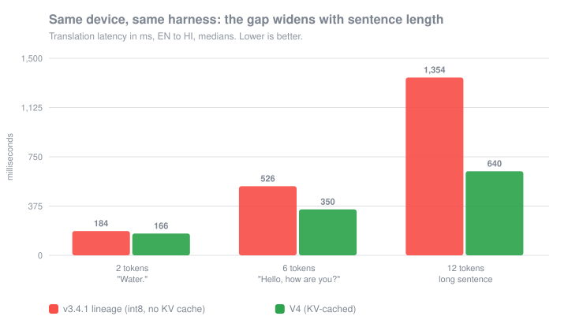</p>

**The gap widens with length — that is the signature of a complexity-class change, not a constant factor.**
The mechanism is the cache, and it is *attributed*, not assumed: the per-token rate **rises** with length in V4
where the un-cached lineage **falls**.

<p align="center">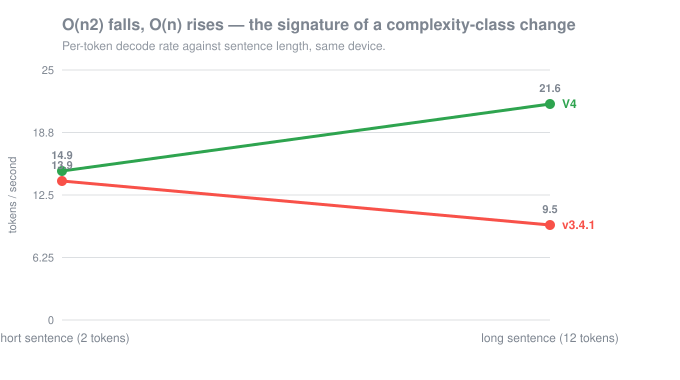</p>

An O(n²) decoder gets *slower per token* the longer you talk to it; an O(n) decoder gets faster as the fixed
setup cost amortizes. On a modern flagship the fully optimized engine translates the 12-token sentence in
**~77–86 ms** and sustains **530–570 tok/s**.

Full method, the negative results, and every limit: **[docs/Optimization.md](docs/Optimization.md)**.

---

## 🕸️ Three-way comparison: v3.4.1 vs V4 vs iPhone

Best observed result per column: **v3.4.1** (the baseline lineage), **V4 on the Galaxy S26 Ultra**
(Snapdragon 8 Elite Gen 5), and **V4 on iPhone** (the fastest iOS run). Every figure below is lifted from
**[BENCHMARK_COMPARISON.md](docs/submission/BENCHMARK_COMPARISON.md)** — nothing is interpolated.

<table>
<tr>
<td>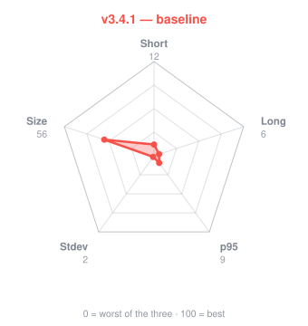</td>
<td>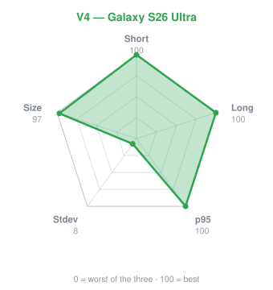</td>
<td>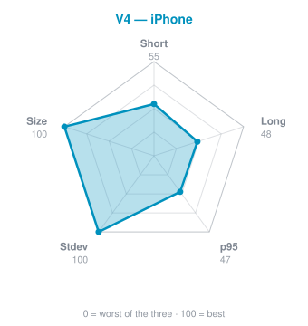</td>
</tr>
</table>

Five axes, each normalized so the best of the three scores 100: **Short** and **Long** sentence speed,
**p95** worst case, **Stdev** consistency, **Size** of the staged model. Bigger shape is better.

The three shapes tell the story on their own. **v3.4.1 is small on every axis.** **V4 on Android** fills the
speed side — it owns short, long and worst-case latency outright. **V4 on iPhone** fills the other side —
the steadiest run in the database and the smallest model on disk. The milliseconds behind each axis are in
the charts below.

### ⏱️ Translation latency — the headline delta

<p align="center">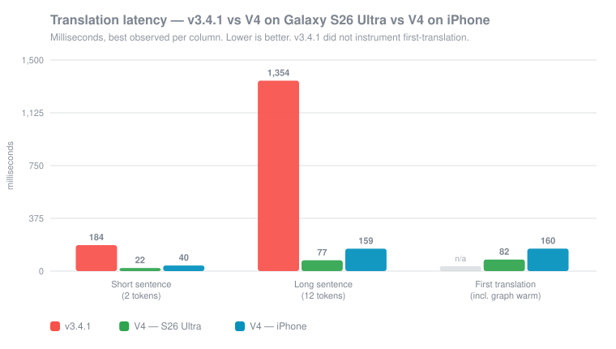</p>

**17.6× faster on the long sentence** (1353.6 → 77.0 ms). The short sentence improves 8.4×; the gap widens
with length because the fix was to the complexity class, not to a constant.

### 📉 Stability — jitter and worst case

<p align="center">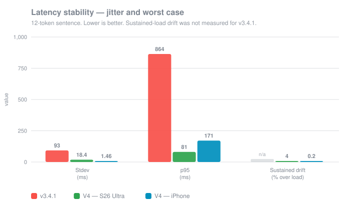</p>

v3.4.1 was **five times jitterier** than V4 and its worst case was ~10× higher. The iPhone run is the most
stable thing in the database — stdev **1.46 ms** and **+0.2%** drift under sustained load.

### 🚀 Startup — engine-init by cache state

<p align="center">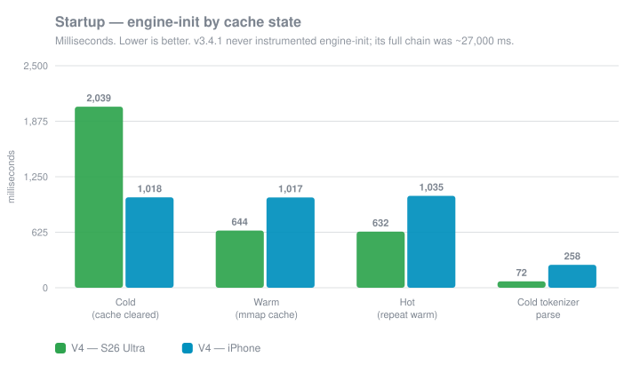</p>

v3.4.1 never instrumented engine-init at all; its full chain took **~27,000 ms**, and V4 re-measured the same
chain at **~5,134 ms** — a **5.3×** cut. Android's warm/hot path (644 / 632 ms) beats iOS because iOS never
gets a warm-cache discount: its three states sit flat at ~1,020 ms.

<p align="center">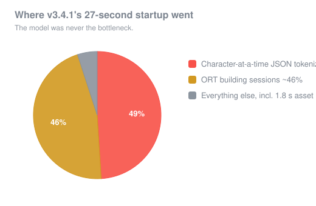</p>

**The model was never the bottleneck.** Roughly half of that 27 s was a character-at-a-time JSON parser and
nearly the other half was ONNX Runtime building sessions. Unpacking 472 MB of assets cost 1.8 s, once.

### 📋 The rest of the table, without the charts

| Metric | v3.4.1 | V4 — S26 Ultra | V4 — iPhone |
|---|---|---|---|
| Steady-state process memory | ~983 MB | **154 MB** | 845 MB ⁑ |
| Staged model cache, per direction | ~490 MB | **279.8 MB** | 272 MB |
| Suite-normalized throughput | different basis | **573.7 tok/s** | 287.9 tok/s |
| Per-graph cost | — | encoder 90 ms · init 59 ms · **step 46 ms/token** | encoder 4.90 · init 4.28 · **step 3.16 ms** |
| Long-input truncation (n=16) | **5 / 16 (31%)** | **0 / 16** | 0 / 16 |
| Greedy-token parity vs fp32 | not verified | **identical** (max Δ 0.448) | identical |

⁑ A different accounting basis on iOS, shown for completeness, not as a like-for-like number.

Three of those deserve a sentence. Turning the CPU arena **off** cost nothing in latency and took the process
from **983 MB to 154 MB**. `decoder_step` runs once per *token* and holds its cost flat regardless of sentence
length — that flatness is the KV cache working, and it is why a 12-token translation spends roughly 79% of its
time there. And both earlier versions shipped a fixed `maxSteps=18` cap that **silently cut 5 of 16 long
inputs** — no error, just a sentence that stopped early; V4 derives the cap from source length and truncates
**none**. That last one matters most to a user and least to a benchmark.

---

## 🔬 KleidiAI & the execution providers

BhashaBridge doesn't guess which kernel ran. It profiled the shipped library with `simpleperf` and decoded
the hottest loop straight out of `.text`:

```asm
smopa za0.s, p2/m, p2/m, z4.b, z8.b   ; KleidiAI SME int8 outer-product — 21.7% of all ORT time
```

**SME is dispatched, and it is the single hottest piece of code in the application. The app disables it
anyway** — because at the shipping thread count, turning it off is **8.9% faster** and ~55–70 MB lighter.
On iOS the identical kernel is a **net win** and stays on. Same kernel, opposite policies, each chosen by
measurement: the project's most useful result.

| Provider | Verdict | Measurement |
|---|---|---|
| 🟢 **MLAS (CPU)** | **shipped** | dot-product / i8mm / SME dispatched per silicon at runtime |
| 🔴 **XNNPACK** | rejected | places **0 nodes** — it silently *is* MLAS |
| 🔴 **NNAPI / NPU** | rejected | **2.3× slower** than the tuned CPU path |

<details>
<summary><b>Why the flagship's 2× is not attributed to the ISA — click to expand</b></summary>

<br>

Arm's KleidiAI ships INT8 matmul kernels reachable **only on SME cores**; on every other Arm part its 8-bit
kernels are dead code and MLAS's dot-product / i8mm kernels do the work. An A/B with `mlas.disable_kleidiai`
prices SME at **only 4–9%** on the Android flagship. That device also changed four variables at once against
the previous best (4 threads vs 1, Oryon vs Cortex-X2, cool vs throttled, SVE2/SME present vs absent), so its
2× lead is the **core + thread count + thermal headroom, not the ISA rung** — and the report says so rather
than claiming the ISA win. The execution-provider rejections are node-placement counts, not vibes: the hot
GEMMs are `com.microsoft` contrib ops, which is a property of the export, confirmed on a second SoC.

</details>

Details: **[docs/ArmPlatform.md](docs/ArmPlatform.md)**.

---

## 🍎 Cross-platform: Android and iOS

The same INT8 model and engine were ported to iOS (also arm64, also big.LITTLE) and re-measured. Same graphs,
different scheduler — so the two platforms are reported **side by side, never averaged**:

| Decision | 🤖 Android | 🍎 iOS |
|---|---|---|
| **KleidiAI / SME** | **off** — forcing it on costs 8.9% | **on** — wins 1.089× / 1.045× |
| **Intra-op threads** | 1–4, derived from topology | **1** — a second thread costs **+16.8% / +11.4%** |
| **How it was decided** | measured on device | measured on device |

That divergence is the point: the same kernel earns opposite policies, and neither was assumed. Full record:
**[docs/Comparison.md](docs/Comparison.md)**, the per-device pages in **[docs/submission/](docs/submission/)**,
and the full write-up in **[PROJECT_WRITEUP.md](docs/submission/PROJECT_WRITEUP.md)**.

---

## 🚀 Get started

<div align="center">

### 📲 Install the prebuilt app — models bundled, no build, offline from the first launch

[](https://github.com/pareshvpk/BhashaBridge---ARM-AI-Optimization/releases/download/v4.0/BhashaBridge-v4-arm64.apk)
[](https://github.com/pareshvpk/BhashaBridge---ARM-AI-Optimization/releases/download/v4.0/ArmSmokeTest-benchapp-arm64.apk)

</div>

Tap on a phone and the APK downloads straight to the device — open it to install (allow "install from this
source" if prompted). Or over adb:

```bash
adb install -r BhashaBridge-v4-arm64.apk
```

**Then, on the phone:** 1️⃣ pick a direction and type or tap the mic · 2️⃣ tap the **stats icon** (top-right)
for live `tokens · ms · tok/s` and the CPU policy chosen for *your* phone · 3️⃣ try an **emergency phrase**
for the instant, model-free path.

<details>
<summary><b>🛠 Or build it from source</b></summary>

<br>

```bash
git clone https://github.com/pareshvpk/BhashaBridge---ARM-AI-Optimization.git
cd BhashaBridge---ARM-AI-Optimization
./gradlew installDebug
```

The model assets are **not in git** (~632 MB): download the asset bundle from **Releases** and stage it, or
regenerate the ONNX graphs — both paths are in **[MODELS.md](MODELS.md)**. Use the exact SDK / NDK / JDK setup
in **[docs/Build.md](docs/Build.md)**; the build is arm64-first and ships every Arm INT8 kernel path in one APK.

</details>

---

## 🗂️ Repository guide

| Location | Purpose |
|---|---|
| `app/` | The Kotlin Android app and the ONNX Runtime inference path |
| `benchapp/` | Standalone **Arm Smoke Test**: runs the ablation on any arm64 phone and exports CSV/JSON. Compiles `:app`'s inference sources |
| `baselineprofile/` | Baseline Profile generation for startup |
| `model_pipeline/` | The export → quantize → verify pipeline (`cached_export.py`, `quantize_cached.py`, `dedup_weights.py`, `verify_cache.py`) |
| `bench/` | Cross-device raw results and the report |
| `docs/` | Architecture, optimization, Arm platform, benchmarks, comparison, build |
| `docs/submission/` | The judge-facing write-up, benchmark pages, and screenshots |

---

## 📚 Documentation

| Document | What it covers |
|---|---|
| [Architecture](docs/Architecture.md) | Structure, decoding, and the on-device KV-cached INT8 runtime |
| [Optimization](docs/Optimization.md) | The technical report: every optimization, kept and reverted |
| [ArmPlatform](docs/ArmPlatform.md) | CPU capability detection and the execution policy derived from it |
| [Benchmarks](docs/Benchmarks.md) | On-device benchmarking across mobile devices; cached vs uncached |
| [Comparison](docs/Comparison.md) | v3.4.1 → V4, measured — including where it is worse |
| [Build](docs/Build.md) | Project structure, dependencies, and how the app is built |
| [Project write-up](docs/submission/PROJECT_WRITEUP.md) | The full Arm Create submission write-up |
| [Benchmark comparison](docs/submission/BENCHMARK_COMPARISON.md) | v3.4.1 / V4 / V4·iOS technical benchmarks |

---

## ⚠️ Known limitations

| | Limitation | Detail |
|---|---|---|
| 📦 | **~619 MB of assets** | Side-loading works today; Play would need asset delivery or a first-run download. This limits reach more than any technical factor here. |
| ⏱️ | **~5 s to first translation** | Down from 27 s, still the worst user-facing number in the project. |
| 🔧 | **Release builds not yet shippable** | Debug-signed, R8 disabled, `versionCode` not incremented. |
| 📱 | **Portrait-only** | Deliberate — the landscape layout was unusable, so it is locked, not left broken. |
| 🎤 | **Speech WER / TTS latency unmeasured** | The bundled Vosk Hindi model publishes 14.96–39.08% WER by test set. |

---

## 🧾 Why trust any of this

**Because the project publishes what it had to withdraw.** The `.ort`-era latency numbers, the "mmap is
exclusive to one platform" conclusion (falsified by a Qualcomm device), the pre-clamp `intra=4` default, and
the hope that an SME part would show a clean 2× — each was recorded, measured against, and corrected in
**[docs/Benchmarks.md](docs/Benchmarks.md)** and **[docs/Optimization.md](docs/Optimization.md)**, with the
numbers that broke it. Every REVERT and NO-EFFECT is kept with its data, and every benchmark carries the entry
temperature it was read at — because on this workload a comparison under ~10% is not readable without one.

*The falsifications are the evidence that the surviving numbers were actually checked.*

---

## ⚖️ License

BhashaBridge V4 is licensed under the **MIT License**. It builds on **ONNX Runtime**, **Arm KleidiAI**, **Vosk**,
and the **IndicTrans2** model from AI4Bharat — each keeps its own license; see
[THIRD_PARTY_NOTICES.md](THIRD_PARTY_NOTICES.md).

<div align="center">
<br>

**Built for the Arm Create submission** · [📄 Write-up](docs/submission/PROJECT_WRITEUP.md) · [📊 Benchmarks](docs/Benchmarks.md) · [⬇ Download](https://github.com/pareshvpk/BhashaBridge---ARM-AI-Optimization/releases/download/v4.0/BhashaBridge-v4-arm64.apk)

</div>
