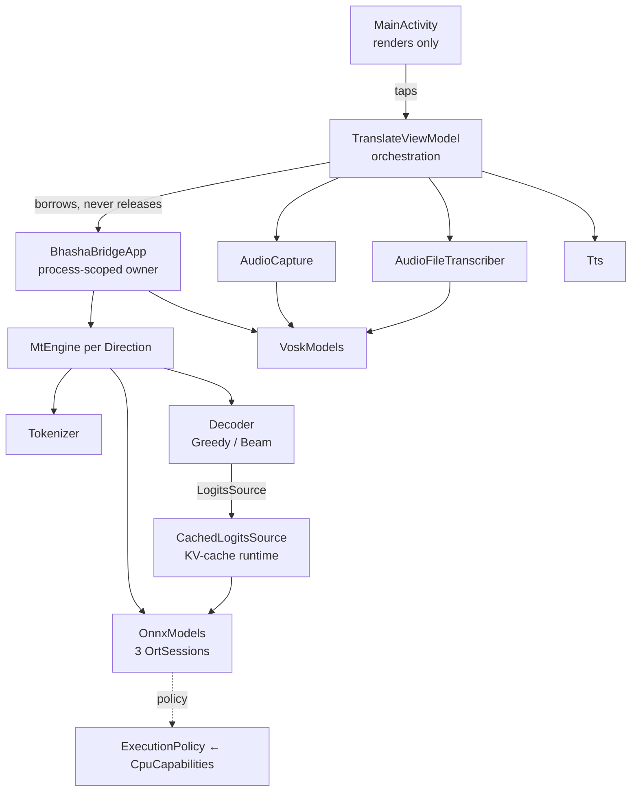

# Engineering Audit — `:app` (BhashaBridge V4)

**Scope:** the shipping app module only (`app/`). `:benchapp`, `:baselineprofile`, `bench/` and
`model_pipeline/` were read for context but are not under review.
**Tree state:** `main` @ `13007e3`, plus 23 uncommitted working-tree files (several of which are
themselves hardening fixes — `extractAsset` staging, `purgeLegacy`, `TrimReleaseTest`). Findings
below are against the **working tree**, not the last commit.
**Date:** 2026-08-06.

---

# Executive Summary

BhashaBridge V4 is a fully offline English↔Hindi speech-to-speech translator: Vosk ASR → an INT8
IndicTrans2 encoder/decoder pair on ONNX Runtime → platform TTS. It is a deliberate rewrite of
v3.4.1, and the rewrite worked. The architecture is the strongest part of the project: one owner for
every native resource, a borrow counter that makes trim-driven release safe, a decode seam that let
the KV-cache land without touching a decoder, and a capability-derived ORT policy backed by a
nine-device measurement database. Documentation is unusually good — most non-obvious decisions carry
their evidence inline, and several comments correctly retract earlier conclusions.

What remains is not architectural. It is a short list of concrete defects on narrow paths: one
native use-after-free window, a JSON parser that mis-reads four dictionary entries (with a unit test
that asserts the bug as correct), a length cap that still truncates long translations after the
commit that claimed to fix truncation, and a lost-stop race in the microphone session. None require
redesign; all are hours of work.

The gap to shipping is deployment, not engineering: the release build is signed with the SDK debug
key, runs with R8 disabled, and has never had its `versionCode` incremented.

```
Overall Health:     ★★★★★★★☆☆☆ (7/10)
Production Ready:   No — 1 critical, 5 high, all fixable in ~2 days
Major Risks:        3
Critical Bugs:      1
Security Issues:    1 (release signing; the runtime attack surface is genuinely small)
Performance Risks:  3
```

---

# Repository Overview

| Aspect | Finding |
|---|---|
| Language | Kotlin (100% of `app/src/main`), JVM target 17 |
| Build | Gradle 9.5 + AGP 9.3.0, version catalog, configuration cache on, `org.gradle.jvmargs=-Xmx8g` |
| Min / target / compile SDK | 24 / 36 / 36.1 |
| Inference | ONNX Runtime Android 1.27.0, three INT8 graphs per direction (encoder, decoder_init, decoder_step) |
| ASR | Vosk 0.3.47, one acoustic model per source language |
| TTS | Platform `TextToSpeech` |
| Async | kotlinx-coroutines 1.7.3, `ViewModel` + `StateFlow`, one single-thread dispatcher for MT |
| Assets | 909 MB (models + 4 vocabularies), `noCompress` on `.onnx` so ORT can mmap |
| Permissions | `RECORD_AUDIO` only. **No `INTERNET`** — the offline claim is enforced by the manifest |
| Entry points | `BhashaBridgeApp` (process), `MainActivity` (launcher), `WelcomeActivity` (first run) |
| CI | GitHub Actions: `assembleDebug` + `testDebugUnitTest` on ubuntu-latest; device tests deliberately excluded |
| External services | None. No network, no analytics, no crash reporter |

Package layout is by subsystem — `mt/`, `speech/`, `ui/`, `bench/` — with `Direction` and `Logging`
in the root package specifically to avoid a `speech → mt` dependency edge. `docs/DEPENDENCY_RULES.md`
states the rule; the code obeys it.

---

# Architecture Assessment



| Property | Rating | Why |
|---|---|---|
| Layer separation | Excellent | The Activity cannot obtain an engine — not by convention, by construction. `ui/` has no import path to `OrtSession`. |
| Ownership / lifetime | Excellent (one hole) | Every native allocation has exactly one owner and one release trigger, with a borrow counter guarding the window. The hole is C1 below. |
| Coupling | Low | `Decoder` sees only `LogitsSource`; swapping greedy for beam touches one constructor argument. The KV-cache rewrite landed with zero decoder changes, which is the seam paying for itself. |
| Cohesion | High | Files average ~150 lines with a stated Purpose/Owns/Lifetime/Thread header. The largest, `OnnxModels` at 489, is genuinely one responsibility (session lifecycle + on-disk graph cache). |
| Extensibility | Good | A third direction needs an enum case, an asset triple and a Vosk folder. Nothing else is direction-aware. |
| Configuration | Good | `OrtTuning` is one knob per field with `null` = "ORT default", so the no-arg instance reproduces pre-tuning behaviour exactly — that is what makes the A/B benchmarks trustworthy. |
| Testability | Mixed | `mt/` and `bench/` are JVM-testable and tested. `speech/` and `ui/` have pure, obviously-testable logic (`rms`, `downmix`, `resample`, `AsrCorrector`) with no JVM tests at all. |

The one structural criticism: `BhashaBridgeApp` is both the resource owner **and** the concurrency
authority (`borrowers`, `releaseWhenIdle`). That is the right call at this size, but the correctness
of every native resource in the app now depends on callers remembering to wrap use in
`withResources`. C1 is exactly that rule being broken once. A `borrowed(direction) { }` helper that
returns the resource *inside* the pin would make the mistake unrepresentable.

---

# Critical Issues

## C1 — Vosk model is acquired outside the borrow window: native use-after-free

**Severity:** CRITICAL (native crash) · **Likelihood:** Low · **Effort:** 15 min · **Confidence:** Observed (code), Inferred (crash)

`app/src/main/java/com/bhashabridge/app/ui/TranslateViewModel.kt:208-226` and `:246-265`

```kotlin
val model = withContext(Dispatchers.IO) { app.speechModels.model(direction) }  // ← not pinned
…
_state.update { it.copy(mic = MicState.Listening, …) }                          // ← window
app.withResources { capture.record(model).collect { … } }                       // ← pinned here
```

**Root cause.** `withResources` is the only thing that increments `borrowers`, and `borrowers` is the
only thing that defers `onTrimMemory`'s `releaseAll()`. The model handle is fetched *before* the
pin, so between the fetch and the pin a `TRIM_MEMORY_BACKGROUND` sees `borrowers == 0`, calls
`VoskModels.release()` → `Model.close()`, and frees the native model. `Recognizer(model, …)` then
runs Vosk JNI against a freed pointer.

`BhashaBridgeApp.kt:120-149`'s own KDoc states the invariant this violates: *"Every path that uses
(not merely fetches) an engine or a Vosk model goes through here."* The MT path obeys it
(`app.withResources { app.translator(direction).translate(input) }`, `:117`); both speech paths do
not.

**Impact.** SIGSEGV — a process kill, not a catchable exception. No data loss (nothing is persisted),
but it is unattributable in a crash report because the stack is inside `libvosk.so`.

**Why it is Low likelihood, not theoretical.** The window is a few hundred microseconds of main-thread
work on the mic path. It is materially wider on `transcribeFile`: the user has just come back from
the system document picker, so the process was backgrounded moments earlier and a trim is genuinely
in flight.

**Fix** — move the fetch inside the pin. `withResources` is `inline`, so suspending inside it is legal:

```kotlin
app.withResources {
    val model = withContext(Dispatchers.IO) {
        try { app.speechModels.model(direction) } catch (e: Throwable) { … ; null }
    } ?: return@withResources
    _state.update { it.copy(mic = MicState.Listening, micStatus = R.string.mic_listening) }
    capture.record(model).collect { event -> onSpeechEvent(event, direction) }
}
```

**Side effect:** the borrow now spans the model *load* (seconds on first use), so a trim arriving
during a cold Vosk load is deferred rather than executed. That is the correct trade — it is the same
rule the MT path already lives under.

**Prevention (recommended, 30 min).** Add to `BhashaBridgeApp`:

```kotlin
inline fun <T> withSpeechModel(direction: Direction, block: (Model) -> T): T =
    withResources { block(speechModels.model(direction)) }
```

and make `speechModels` `internal`/`@PublishedApi`. Then "fetch without pinning" stops being
expressible, which is the same technique that made the v3.4.1 leak unrepeatable.

---

# High Priority Issues

## H1 — The dictionary parser mis-decodes JSON escapes; the unit test asserts the bug

**Severity:** HIGH · **Likelihood:** Certain (input-dependent) · **Effort:** 30 min · **Confidence:** Observed, reproduced

`app/src/main/java/com/bhashabridge/app/mt/Tokenizer.kt:184-186`

```kotlin
escape -> { sb.append(ch); escape = false }          // appends the escaped char…
ch == '\\' && inString -> { sb.append(ch); escape = true }   // …after already appending the backslash
```

Both the backslash and the character it escapes are appended, so `"▁\""` in the JSON becomes the
three-character key `▁\"` instead of the two-character piece `▁"`.

**Verified against the shipped vocabularies** by running the parser's exact state machine over the
real files and diffing against `json.load`:

```
dict.SRC.json   32,322 entries — 2 wrong:  ▁" (id 12),  \ (id 3647)
dict.TGT.json  122,672 entries — 4 wrong:  ▁" (7), ▁\ (5839), \ (18387), " (100458)
dict.SRC_HI.json                — 4 wrong (same shape)
dict.TGT_EN.json                — 2 wrong (same shape)
```

**Two user-visible consequences:**

1. **Encode.** A typed `"` never matches its piece (stored under a key that cannot be produced from
   input text), falls through `greedyEncode`, finds no substring match either, and becomes `<unk>`
   (id 3). Quoting someone — the archetypal use for a translation app — silently degrades.
2. **Decode.** `tgtIdToPiece` maps id 7 and id 100458 to the corrupted strings, so whenever the model
   emits a quote token the Hindi output on screen (and into TTS) contains a literal **`\"`**.

**Root cause of the root cause** — `app/src/test/java/com/bhashabridge/app/mt/TokenizerTest.kt:59-63`:

```kotlin
@Test
fun `flat dict parser reads keys with escaped quotes`() {
    val map = Tokenizer.parseFlatIntDict(StringReader("""{"a": 1, "b\"c": -2, "d": 3}"""))
    assertEquals(mapOf("a" to 1, "b\\\"c" to -2, "d" to 3), map)   // ← expects backslash + quote
}
```

The raw string means the parser is fed JSON for `b"c`; the assertion expects `b\"c`. The test that
exists precisely to cover this case **encodes the defect as the specification**, which is why it has
survived. A test can only protect behaviour someone checked once by hand.

**Fix:**

```kotlin
escape -> {
    sb.append(
        when (ch) {
            'n' -> '\n'; 't' -> '\t'; 'r' -> '\r'; 'b' -> '\b'; 'f' -> '\u000C'
            else -> ch          // covers \" \\ \/ — the only escapes these vocabularies use
        }
    )
    escape = false
}
```

and correct the test to `assertEquals(mapOf("a" to 1, "b\"c" to -2, "d" to 3), map)`.

`\uXXXX` is **not** handled by the above and is not present in any of the four shipped dictionaries
(confirmed by the same diff — the only lost keys are the escape-pair ones). If `model_pipeline` ever
emits `ensure_ascii=True` JSON, every non-ASCII piece becomes `\uXXXX` and the whole target vocabulary
breaks. Either add the 4-hex-digit branch, or assert `ensure_ascii=False` in the exporter. Recommend
both — the exporter assertion is one line and catches it before the APK is built.

## H2 — Long translations are still silently truncated, one commit after the truncation fix

**Severity:** HIGH · **Likelihood:** Medium-High · **Effort:** 1 h · **Confidence:** Observed (code + test)

`app/src/main/java/com/bhashabridge/app/mt/Decoder.kt:81`

```kotlin
fun targetCap(sourceLen: Int): Int = maxOf(minTargetLen, sourceLen).coerceAtMost(maxSteps)
```

Commit `99d163b` correctly identified that `maxSteps = 18` was the real limit and raised it to 128.
But the *working* limit is now `targetCap`, which permits a target no longer than its **source token
count** (floor 14, ceiling 128). `DecoderTest:80-85` pins this exactly: a 40-token source yields at
most 39 generated tokens.

Machine translation does not preserve token count. EN→HI on IndicTrans2's SentencePiece vocabularies
expands for most inputs, and every language pair has sentences where the target is longer than the
source. When it happens the decoder stops mid-sentence, emits no EOS, and **nothing tells the user**
— the same failure mode, the same silence, that the previous commit set out to eliminate. The three
tokens of slack from `encode`'s two language tags plus `</s>` are the only headroom.

`docs/ENGINEERING_PLAN.md:473` already carries the unfinished half of this: *"fix N8: signal
truncation to the user rather than silently cutting"*.

**Fix** — give the cap expansion headroom, and make truncation observable:

```kotlin
/** Target length may exceed the source: MT expands. 1.6× + 8 covers observed EN↔HI expansion. */
fun targetCap(sourceLen: Int): Int =
    maxOf(minTargetLen, (sourceLen * 16) / 10 + 8).coerceAtMost(maxSteps)
```

and have `GreedyDecoder` distinguish "stopped on EOS" from "hit the cap" so `MtEngine` can append an
ellipsis or `TranslateViewModel` can surface a "translation shortened" hint. A `Metrics.counter
("hit_cap", 1)` in debug builds would also have made this visible during the cross-device runs.

**Side effect:** worst-case latency rises with the cap. At the SM-M315F's ~41 ms/token, a 60-token
source now permits ~104 tokens ≈ 4.3 s instead of ~2.5 s. That is the correct trade against a wrong
answer, and `maxSteps = 128` still bounds it.

**Validation:** the honest check is a corpus one — run 200 sentences of varied length through both
directions on device and count how many stop without EOS. That number belongs in
`docs/VALIDATION_REPORT.md`; right now nothing measures it.

## H3 — `stop()` is lost if it arrives before the recording flow starts

**Severity:** HIGH · **Likelihood:** Medium · **Effort:** 20 min · **Confidence:** Observed

`app/src/main/java/com/bhashabridge/app/speech/AudioCapture.kt:55-60` and `:115`

`stop()` sets `recording = false`; `record()` sets `recording = true` **inside the flow builder**,
which runs on `Dispatchers.IO` only once collection begins — after the model load, the state updates
and the coroutine hop. A `stop()` in that window is overwritten and the session records until the
user stops it a second time.

Concretely: tap mic → immediately tap again (or `MainActivity.onStop()` fires because the user left
the app, `MainActivity.kt:132-135`) while the Vosk model is still loading. The comment on `onStop`
states the requirement this breaks — *"a recording session must not outlive the visible screen — the
mic light would stay on"*.

**Fix** — make stop monotonic per session with a generation counter, so a stop can never be lost to
a later start:

```kotlin
private val generation = AtomicInteger(0)
private val stopRequested = AtomicInteger(-1)

fun stop() { stopRequested.set(generation.get()) }

fun record(model: Model): Flow<SpeechEvent> = flow {
    val myGen = generation.incrementAndGet()
    …
    while (stopRequested.get() < myGen && currentCoroutineContext().isActive) { … }
}
```

The `@Volatile Boolean` alone cannot express "stop the session that is about to start", which is the
whole failure.

## H4 — The release build cannot be shipped as-is

**Severity:** HIGH (deployment blocker) · **Effort:** 1-2 h · **Confidence:** Observed

`app/build.gradle.kts:22-46`

| Setting | Current | Problem |
|---|---|---|
| `signingConfig` | `signingConfigs.getByName("debug")` | Play rejects debug-signed uploads; the key is not the owner's and cannot be rotated into one later without a new package. The comment acknowledges this is temporary — it is now the last blocker. |
| `optimization { enable = false }` | R8 off | No shrinking, no obfuscation, no resource stripping. `Metrics` and `logDebug` compile out by language guarantee (`BuildConfig.DEBUG`), which is why this has been survivable, but every unused AndroidX class ships. |
| `versionCode` / `versionName` | `1` / `"1.0"` | Never incremented. Also feeds `OnnxModels.cacheStamp` (`:332`), so two different builds share an ORT cache key — an update that changes graph handling without changing asset length reuses a stale baked `.ort`. |

**Fix:** real keystore referenced from `~/.gradle/gradle.properties` (never committed), R8 enabled
with a `proguard-rules.pro` that keeps `ai.onnxruntime.**` and `org.vosk.**`, and a `versionCode`
bumped from CI or a git-describe. Re-run `BenchmarkSuiteTest` after enabling R8 — that is a real
behaviour change on the inference path and must not be taken on trust.

## H5 — `micJob` is published across threads without synchronisation

**Severity:** HIGH · **Likelihood:** Low-Medium · **Effort:** 15 min · **Confidence:** Observed

`app/src/main/java/com/bhashabridge/app/ui/TranslateViewModel.kt:197, 232, 244, 270`

```kotlin
if (micJob != null) return          // read on main
micJob = viewModelScope.launch { … }
micJob?.invokeOnCompletion { micJob = null }   // written on whichever thread completes the job
```

`invokeOnCompletion` runs on the completing thread, not the main dispatcher, so a plain `var` is
written off-main and read on-main with no happens-before edge. Two outcomes: a stale non-null read
blocks the mic permanently ("nothing happens when I tap"), or a stale null read starts a second
session while the first is finishing its flush — two `Recognizer`s on one model and two `AudioRecord`s
competing for the mic.

**Fix:** confine the write to the main dispatcher — `invokeOnCompletion { viewModelScope.launch {
micJob = null } }` — or replace the flag with `micJob?.isActive == true`, which reads the job's own
synchronised state.

---

# Medium Priority Issues

**M1 — The repetition penalty damps EOS on every step.** `Decoder.kt:94-102`. IndicTrans2 uses id 2 as
both start and stop (`DecodeConfig:52-53`), so the start token sits in the prefix from step 0 and the
penalty divides the EOS logit by 1.1 at every step. The model is systematically discouraged from
stopping, which compounds H2. This matches HuggingFace's `RepetitionPenaltyLogitsProcessor` behaviour
(it also penalises the decoder start token), so it is defensible as parity — but it should be a
*decision*, not an accident. Recommend excluding `eosToken` from the penalty and measuring output
length distribution before/after. Effort: 10 min + a corpus run.

**M2 — `AsrCorrector` replaces substrings without word boundaries.** `AsrCorrector.kt:29-76` mixes
entries that carry their own boundary (`"she go "` with a trailing space) with entries that do not
(`"i is"`, `"i are "`, `"he want"`). `"delhi is far"` contains `"i is"` at index 4 and becomes
**`"delhi am far"`**. The contraction table already does this correctly with
`Regex("\\b…\\b")` (`:115`) — apply the same treatment to `englishPhrases`, or prefix/suffix every
entry with a space and pad the input. Effort: 30 min. This is pure, JVM-testable code with zero unit
tests (see M9).

**M3 — File transcription cannot be cancelled and can hang.** `AudioFileTranscriber.decodeTrack:158-191`
loops until `outputDone` with no `ensureActive()` and no wall-clock ceiling; a codec that never
signals EOS (malformed container, vendor decoder bug) spins forever on `Dispatchers.IO`. Separately,
`TranslateViewModel.stopRecording()` only calls `capture.stop()`, so there is **no** way for the user
to abort a file transcription at all — `micJob` stays non-null and the mic button stays inert.
Add `currentCoroutineContext().ensureActive()` to the decode loop and make `stopRecording()` cancel
`micJob`. Effort: 30 min.

**M4 — The tokenizer lowercases all source text.** `Tokenizer.kt:44-50` tries `▁lower`, `▁Title`,
`▁UPPER` for the whole-word hit but falls back to `greedyEncode("$MARK$lower")` — so any word not
matched whole is encoded from its lowercased form, and case never reaches the model. IndicTrans2's
own tokenizer is case-preserving. "US" vs "us", "March" vs "march", and every proper noun degrade.
Mirrors v3.4.1 by design; worth an A/B on translation quality before keeping. Effort: 1 h + eval.

**M5 — First-run check does blocking disk I/O on the main thread.** `MainActivity.kt:97` →
`WelcomeActivity.isFirstRun` reads SharedPreferences inside `onCreate`, before `setContentView`. Also,
because the flag is only written in `finishWith`, a user who backs out of the tour sees it again on
every launch, and every Activity recreation re-launches it. Move the read behind
`lifecycleScope.launch(Dispatchers.IO)` or accept it and document it; gate the relaunch on
`savedInstanceState == null`. Effort: 20 min.

**M6 — Tokenizer parsing is serial with, not parallel to, session loading.** `MtEngine.kt:34-35`
initialises `tokenizer` then `models`. The three ONNX sessions already load on three threads
(`OnnxModels:88`), but the two dictionary parses — measured at ~1.08 s after the Phase 11B fix
(`Tokenizer.kt:96-99`) — run first, alone, on the calling thread. Submitting the tokenizer as a
fourth task, or parsing the two vocabularies in parallel, removes ~0.5-1 s from a ~10.5 s cold start
at no risk (the objects are independent). The larger win is shipping a packed vocabulary (sorted
`String[]` + `int[]`, or a single `.bin`) instead of parsing 3.4 MB of JSON per launch. Effort: 1 h /
1 day respectively.

**M7 — Per-token allocation on the decode hot path.** `applyRepetitionPenalty` calls
`prefix.toHashSet()` (`Decoder.kt:96`), boxing every prefix token into a `java.lang.Long` once per
generated token — O(n²) boxed allocations per translation. Negligible against 41 ms/token, but it
contradicts `CODING_STANDARDS 9.2`'s zero-allocation budget for the decode loop. A reusable
`LongArray` scratch sorted once per step, or simply penalising duplicates twice (measurably
equivalent for a 1.1 penalty over short prefixes), removes it.

**M8 — No free-space check before extracting hundreds of MB.** `OnnxModels.extractAsset` writes each
`.onnx` to `filesDir` for the one-time bake; combined with the retained `.ort` files the app needs
~1.4 GB transiently. On a full device the `IOException` propagates to
`TranslateViewModel.load`'s catch-all (`:157-161`) and the user is told
`error_direction_unavailable` — the same message used for "this direction was never exported".
Check `filesDir.usableSpace` against `assetLength * 2` before baking and surface a distinct
"not enough storage" message. Effort: 45 min.

**M9 — Test coverage is inverted relative to risk.** The `mt/` package — the best-understood, most
measured code — has 4 JVM test classes and 12 instrumented ones. `speech/` and `ui/` have none on the
JVM, despite containing pure functions that are trivial to test and that this audit found defects in:
`AudioCapture.rms`, `AudioFileTranscriber.downmix`/`resample`, all of `AsrCorrector`, and the
`TranslateUiState` transitions. `AsrCorrector` alone is 160 lines of string rules with zero coverage
and a live bug (M2). Effort: half a day for meaningful coverage of the pure paths.

---

# Low Priority Improvements

- **L1** — `cacheStamp` (`OnnxModels.kt:331`) keys on asset *length*, not content. A re-export that
  happens to preserve length reuses a stale baked graph. Documented trade-off (hashing 600 MB per
  launch is worse); a length + mtime pair, or an exporter-emitted version string in the asset name,
  closes it for free.
- **L2** — `Metrics` is thread-confined, so the per-graph timings captured on session-load workers
  have to be replayed by hand (`SessionLoad.report`). Works, documented, but it is the second place
  the ThreadLocal design has needed a workaround; a coroutine-context-propagating run would remove
  both.
- **L3** — `MainActivity.showAbout` formats `policy.intraThreads` (an `Int?`) straight into a string
  resource; on a device where the policy leaves it null the About dialog reads "null". Debug-only.
- **L4** — `WaveformView.push` does a 32-element shift per audio buffer (~4 Hz) — fine, but a ring
  buffer with a moving head is the same code with no shift.
- **L5** — CI runs neither `lint` nor `:benchapp`, and there is no ktlint/detekt gate. `./gradlew
  :app:lintDebug` on the same job is minutes of work and catches the manifest/resource class of
  problem this audit did not look for.
- **L6** — `EmergencyPhrases` is EN→HI only and always spoken in Hindi
  (`TranslateViewModel.kt:354-357`); in HI→EN mode the emergency sheet shows the wrong direction's
  pairs. By design today, but it is direction-blind logic in a codebase whose central lesson (L11)
  was direction-blind logic.

---

# Security Review

The attack surface is deliberately, unusually small, and the manifest enforces it rather than
documenting it.

| Area | Finding | Severity |
|---|---|---|
| Network | **No `INTERNET` permission.** The "fully offline" claim is structurally true — no library can phone home. | ✅ |
| Permissions | `RECORD_AUDIO` only. Audio import uses `ACTION_OPEN_DOCUMENT`, so no storage permission is requested (v3.4.1 declared `READ_EXTERNAL_STORAGE`). | ✅ |
| Secrets | None in the repo. No API keys, no tokens, no endpoints. | ✅ |
| Data at rest | Nothing user-generated is persisted. History is in-memory only and explicitly justified (`TranslateViewModel.kt:322-326`) — speech translations should not outlive the session on disk. | ✅ |
| Backup / transfer | `backup_rules.xml` + `data_extraction_rules.xml` exclude `file` and `external` domains; only the locale and first-run flag leave the device. | ✅ |
| Logging | `logDebug` takes a lambda and is `inline`, so user speech and translation text are *never built* in release, let alone logged. R8.2 is a language guarantee here, not a convention. | ✅ |
| Untrusted input | Imported audio is parsed by platform `MediaExtractor`/`MediaCodec` (the OS's problem, and hardened), with a duration cap and a sample-count cap so a duration-less file cannot decode unbounded. | ✅ |
| Exported components | Only `MainActivity` (launcher). It reads no intent extras. `WelcomeActivity` is `exported="false"`. | ✅ |
| **Release signing** | **Signed with the SDK debug key** (`build.gradle.kts:38-44`). Not exploitable on a device, but it is an unshippable artifact and the update-integrity story does not exist until a real key does. | **HIGH** |
| Obfuscation | R8 disabled. Low practical value for an offline app with no secrets; noted for completeness. | LOW |
| Dependencies | ORT 1.27.0 (current), Vosk 0.3.47 (current), coroutines 1.7.3 and lifecycle 2.7.0 (a year+ behind, no known advisories relevant here). No transitive vulnerability scanning in CI. | LOW |

Nothing in this module handles authentication, authorization, crypto, serialization of untrusted
objects, SQL, or web content. Those sections of a standard checklist are not applicable and are
omitted deliberately rather than passed silently.

---

# Performance Review

The measured baseline is strong and, unusually, honest — `bench/results/cross-device/` covers nine
devices, and several conclusions in the docs are explicit retractions of earlier ones. What follows
is what is left, not a complaint about what is there.

| # | Finding | Cause | Estimated impact | Trade-off |
|---|---|---|---|---|
| P1 | `decoder_init` computes and returns logits for **every** prefix position; the runtime reads one row and discards the rest | Graph export shape | One full `[1, dec_len, vocab]` allocation + copy per translation. Already identified in `MtEngine.kt:228-231` | Requires a `model_pipeline` re-export and a full re-validation; the copy-halving in `13007e3` was the cheap half |
| P2 | Dictionary parse (~1.08 s) runs serially before the parallel session load | `MtEngine.kt:34-35` init order | ~0.5-1 s off a ~10.5 s cold start | None — the objects are independent (M6) |
| P3 | `prefix.toHashSet()` per generated token | `Decoder.kt:96` | Small; violates the stated zero-allocation budget | None (M7) |
| P4 | 909 MB of `noCompress` assets; ~1.4 GB transient install footprint | Model size | Excludes low-storage devices entirely; the extraction failure path is a generic error message | Compression is impossible — ORT must mmap. The real lever is model size / a download-on-first-run variant, which would cost the offline-by-construction property |
| P5 | `argmax` scans 122,672 floats per token | Vocabulary size | ~0.1 ms/token — not worth touching | — |

Two settled results worth not re-deriving (from `docs/` and the cross-device DB): `intraThreads = 2`
is the optimum on every measured topology including 8-big-core Oryon, and `cpuArena = false` is
correct on the production path (the "12% cost" was a non-production-path artifact).

---

# Code Quality Review

**Strengths, stated plainly because they are unusual.** Every file opens with
Purpose / Owns / Lifetime / Thread. Non-obvious decisions carry their evidence *and their
measurement* inline (`Tokenizer.kt:92-104` gives 9951 ms → 1082 ms → an 18 ms floor). Several
comments retract earlier conclusions rather than quietly editing them
(`MtEngine.kt:210-213` on `getFloatBuffer` not being zero-copy; `ExecutionPolicy.kt:25-38` on the
thread cap dropping from 4 to 2). Failure paths are handled at the level where the resource is held,
not delegated upward — `AudioCapture.kt:99-113` acquires effects and recogniser in separate guards
specifically because a single `try` would only cover the last acquisition.

**Weaknesses.**

- **Comments occasionally outrun the code.** `BhashaBridgeApp`'s KDoc asserts an invariant
  (`withResources` on every use) that two call sites break (C1). A stated invariant with no
  enforcement is a comment, not a rule.
- **A test that documents a defect.** H1's `TokenizerTest` case is the clearest instance of a general
  risk in this codebase: tests are written from the implementation's behaviour rather than from the
  format's specification. For a JSON subset parser, the specification was one `json.load` away.
- **`OnnxModels` at 489 lines** is at the edge. Session lifecycle and the on-disk graph cache are
  separable (`OrtGraphCache` owning bake/load/stamp/purge would be ~150 lines and independently
  testable).
- **Uncommitted work.** 23 modified files sit in the working tree, several of them real fixes
  (`extractAsset` staging, `.part` purge, `TrimReleaseTest`). They are unreviewed, untested by CI,
  and one power cut from lost. Commit them.

---

# Bug Prediction

| Prediction | Why likely | Likelihood | Severity | Fix difficulty |
|---|---|---|---|---|
| Crash reports inside `libvosk.so` with no Java frames | C1's window widens on the file-import path, which resumes from another app | Low-Med | Critical | Trivial |
| "Translation stops mid-sentence" bug reports | H2 — any sentence whose target expands past its source token count | Med-High | High | Easy |
| Stray `\"` in Hindi output, reported as "weird characters" | H1 — one token id in the target vocabulary | Med | Med | Trivial |
| "The mic keeps recording after I leave the app" | H3 — stop lost during a cold Vosk load | Med | High | Easy |
| "The mic button does nothing" until restart | H5 — stale `micJob` | Low | Med | Trivial |
| Install/first-launch failures on low-storage devices, reported as "the app doesn't work" | M8 — no space check, generic error text | Med | Med | Easy |
| Whole target vocabulary breaks after a `model_pipeline` change | H1's `\uXXXX` gap if an exporter ever writes `ensure_ascii=True` | Low | Critical | Trivial (assert in exporter) |
| ORT cache staleness after a re-export of identical byte length | L1 | Low | Med | Easy |

---

# Refactoring Recommendations (by return on investment)

1. **`withSpeechModel(direction) { }` on `BhashaBridgeApp`** — makes C1's class of mistake
   unrepresentable. ~30 min, removes an entire failure mode.
2. **Fix `parseFlatIntDict` and its test** (H1) — 30 min, correctness on real input, and it removes a
   test that actively defends a bug.
3. **`targetCap` expansion factor + a truncation signal** (H2) — 1 h, closes the defect the previous
   commit half-closed.
4. **Generation-counter stop in `AudioCapture`** (H3) — 20 min, and it makes `stop()` correct by
   construction rather than by timing.
5. **JVM tests for `AsrCorrector`, `rms`, `downmix`, `resample`** (M9) — half a day, covers the two
   packages with zero coverage and pins M2's fix.
6. **Split `OrtGraphCache` out of `OnnxModels`** — half a day, makes the cache independently testable
   (today it is only exercised through `OptCacheTest` on a device).
7. **Parallel/packed tokenizer load** (M6) — 1 h for the easy half of a ~1 s startup win.

---

# Patch Suggestions

**C1 — pin before fetching** (`TranslateViewModel.startRecording`, same shape for `transcribeFile`):

```diff
-            val model = withContext(Dispatchers.IO) {
-                try { app.speechModels.model(direction) } catch (e: Throwable) { … ; null }
-            }
-            if (model == null) { … ; return@launch }
-            _state.update { it.copy(mic = MicState.Listening, micStatus = R.string.mic_listening) }
-            try {
-                app.withResources {
-                    capture.record(model).collect { event -> onSpeechEvent(event, direction) }
-                }
-            } finally { … }
+            try {
+                // The borrow opens BEFORE the model handle exists, and closes after the last use of
+                // it. Fetching outside the pin let a TRIM_MEMORY_BACKGROUND free the model between
+                // the two — a native use-after-free, not an exception.
+                app.withResources {
+                    val model = withContext(Dispatchers.IO) {
+                        try { app.speechModels.model(direction) } catch (e: Throwable) {
+                            logError(LogTag.UI, "Speech model unavailable: $direction", e); null
+                        }
+                    }
+                    if (model == null) {
+                        _state.update { it.copy(mic = MicState.Idle, micStatus = R.string.mic_unavailable) }
+                        return@withResources
+                    }
+                    _state.update { it.copy(mic = MicState.Listening, micStatus = R.string.mic_listening) }
+                    capture.record(model).collect { event -> onSpeechEvent(event, direction) }
+                }
+            } finally { … }
```

**H1 — decode the escape instead of keeping both characters** (`Tokenizer.parseFlatIntDict`):

```diff
-                        escape -> { sb.append(ch); escape = false }
+                        // JSON escapes: emit what the escape MEANS. Appending the backslash too
+                        // stored `▁"` under the key `▁\"`, so quotes encoded as <unk> and decoded
+                        // as a literal backslash in the output. 4 of 122,672 target pieces.
+                        escape -> {
+                            sb.append(
+                                when (ch) {
+                                    'n' -> '\n'; 't' -> '\t'; 'r' -> '\r'
+                                    'b' -> '\b'; 'f' -> '\u000C'
+                                    else -> ch          // \" \\ \/
+                                }
+                            )
+                            escape = false
+                        }
```

```diff
-        assertEquals(mapOf("a" to 1, "b\\\"c" to -2, "d" to 3), map)
+        // The JSON says b"c. The parser must produce b"c — not b\"c.
+        assertEquals(mapOf("a" to 1, "b\"c" to -2, "d" to 3), map)
```

**H2 — headroom in the cap** (`DecodeConfig`):

```diff
-    fun targetCap(sourceLen: Int): Int = maxOf(minTargetLen, sourceLen).coerceAtMost(maxSteps)
+    /**
+     * Translation expands: a target is routinely longer than its source in tokens, so a cap equal to
+     * the source length truncates mid-sentence exactly as `maxSteps = 18` used to. 1.6× + 8 covers
+     * observed EN↔HI expansion and still clamps into [maxSteps].
+     */
+    fun targetCap(sourceLen: Int): Int =
+        maxOf(minTargetLen, (sourceLen * 16) / 10 + 8).coerceAtMost(maxSteps)
```

---

# Technical Debt Report

**Level: Low-Moderate**, and unusually well-documented — most of it is *recorded* debt
(`ponytail:` markers, "future work" in `VALIDATION_REPORT.md`, the N8 checkbox in
`ENGINEERING_PLAN.md`) rather than discovered debt.

| Source | Cost of ignoring | Repayment priority |
|---|---|---|
| Release build not shippable (H4) | Blocks every distribution channel | **Now** |
| Invariants stated in comments, not enforced (C1) | Recurs whenever a new call site is added | **Now** |
| Tests written from behaviour, not specification (H1) | Green suite, wrong output | **Now** |
| `speech/` + `ui/` with no JVM tests (M9) | Defects like M2 ship and are found by users | This sprint |
| `decoder_init` returning full-prefix logits (P1) | Permanent per-translation overhead | Next release |
| 23 uncommitted files | Unreviewed, un-CI'd, loseable | Today |
| No lint/static analysis gate (L5) | Manifest/resource regressions land silently | This sprint |

---

# Risk Matrix

| Issue | Severity | Likelihood | Impact | Fix Difficulty | Priority |
|---|---|---|---|---|---|
| C1 Vosk use-after-free | Critical | Low | Process crash | Trivial | **P0** |
| H4 Release unshippable | High | Certain | Cannot ship | Easy | **P0** |
| H1 Dictionary escape bug | High | Certain (on quotes) | Wrong tokens + visible `\"` | Trivial | **P0** |
| H2 Length cap truncation | High | Med-High | Silent wrong output | Easy | **P0** |
| H3 Lost stop | High | Medium | Mic stays live | Easy | **P1** |
| H5 `micJob` race | High | Low-Med | Mic wedged / double session | Trivial | **P1** |
| M3 Uncancellable transcription | Medium | Low-Med | UI wedged | Easy | **P1** |
| M2 ASR substring corruption | Medium | Medium | Garbled input text | Easy | **P1** |
| M1 EOS penalised | Medium | Certain | Longer output, more truncation | Trivial | **P2** |
| M8 No storage precheck | Medium | Medium | Confusing failure | Easy | **P2** |
| M6 Serial tokenizer load | Medium | Certain | ~1 s startup | Easy | **P2** |
| M4 Case destroyed | Medium | Certain | Quality loss | Medium | **P2** |
| M9 Coverage gaps | Medium | — | Future defects | Medium | **P2** |

---

# Action Plan

**Immediate (today)**
1. Commit the 23 working-tree files — they contain real fixes and are currently unreviewed and
   unbacked. *Why now:* everything below builds on them.
2. C1 (15 min) + H1 parser and test (30 min) + H3 (20 min). *Why now:* three defects, ~1 hour total,
   two of them user-visible and one a crash. All independent.
3. H5 (15 min) — same file as C1, same review.

**This week**
4. H2 with a truncation signal, plus a 200-sentence corpus run in both directions counting
   no-EOS stops. *Why:* the fix is easy; the evidence that it worked is the actual deliverable, and
   nothing currently measures it. Depends on nothing.
5. M3 (cancellable transcription) and M2 (word-boundary ASR rules), with the JVM tests from M9 that
   pin M2. *Why together:* same package, same test file.
6. H4 — real keystore, R8 on, `versionCode` from CI. Re-run `BenchmarkSuiteTest` afterwards.
   *Why this week, not today:* R8 is a real behaviour change on the inference path and needs the
   device benchmark to sign it off.

**This month**
7. M6 (tokenizer load overlapped with sessions) and M8 (storage precheck + distinct error message).
8. M1 — exclude EOS from the repetition penalty, measured against the same corpus as H2.
9. Add `lintDebug` to CI; consider detekt.
10. Split `OrtGraphCache` out of `OnnxModels`.

**Future**
11. ~~P1 — re-export the decoder graphs to slice the last position inside the graph. Largest remaining
    inference win~~ — **done and measured, NO GAIN on the shipping path (OPTIMIZATION_SUMMARY §3.31).**
    Greedy calls `decoder_init` once per translation at `dec_len = 1`, so the slice removes no work:
    49.6 ms against a 49.0 ms control on the M31. Re-exported, gate 7/7, held for beam (§9 Q6), which
    is the only workload that reaches the 12–26% host numbers.
12. Packed binary vocabulary to remove JSON parsing from startup entirely.
13. M4 — case-preserving tokenization, gated on a quality A/B.
14. Landscape layout (currently locked to portrait, recorded in `VALIDATION_REPORT.md`).

---

# Final Verdict

**Engineering quality: high. Production readiness: not yet — but the gap is short and specific.**

This is a codebase that learned from its predecessor in a way most rewrites claim and few demonstrate:
the v3.4.1 leak is fixed structurally rather than by vigilance, the 961-line Activity is now a
386-line renderer that *cannot* reach an engine, and the performance work is backed by a nine-device
measurement database whose conclusions are revised in public when the evidence changes. The
documentation would let a new engineer be productive in a day.

The defects found are the kind that survive good architecture: they live on narrow input paths
(a quote character, a long sentence), in timing windows a few hundred microseconds wide, and in one
case inside a unit test that asserts the wrong answer. That last one is worth dwelling on — it is the
only finding here that a careful reviewer would have needed external evidence to catch, and it is
also the cheapest to fix.

**Biggest strengths:** resource ownership and lifetime discipline; evidence-carrying documentation;
a genuinely enforced offline guarantee (no `INTERNET` permission, no logging of user content in
release).

**Biggest weaknesses:** invariants stated in comments but not enforced by the API; test coverage
inverted relative to risk (best-tested where best-understood); a release build configuration that
has not been touched since the skeleton.

**Top three before release:**
1. **C1** — close the Vosk use-after-free window (15 minutes; it is the only native crash left).
2. **H1 + H2** — the tokenizer escape bug and the length cap, both of which produce silently wrong
   output today.
3. **H4** — real signing key, R8 on, `versionCode` policy. Nothing ships without it.

---

# Quality Scoring

```
Architecture ............  9/10   One owner per native resource, enforced layering, a decode seam
                                  that absorbed a full KV-cache rewrite with zero decoder changes.
                                  Docked for an invariant that lives only in a comment (C1).
Code Quality ............  8/10   Consistent headers, evidence in comments, honest retractions.
                                  Docked for OnnxModels' size and a test that asserts a defect.
Maintainability .........  8/10   Small files, explicit dependency rules, decisions traceable to
                                  measurements. Docked for 23 uncommitted files.
Performance .............  8/10   Measured across nine devices; parallel session load, ORT-format
                                  mmap cache, tuned threads. Two known levers left (P1, P2).
Security ................  8/10   No network, no secrets, no persisted user data, no user content
                                  in release logs. Docked for release signing.
Reliability .............  6/10   One use-after-free window, one lost-stop race, one thread-unsafe
                                  field, silent truncation on long input.
Documentation ...........  9/10   20 design docs plus inline rationale that states its evidence.
                                  Among the best this reviewer has audited.
Testing .................  6/10   Strong where the risk is understood, absent where it is not:
                                  speech/ and ui/ have no JVM tests, and one existing test pins a bug.
Scalability .............  7/10   A third direction is an enum case plus assets. Bounded by a
                                  909 MB asset payload that no amount of code can shrink.
Deployment Readiness ....  4/10   Debug signing key, R8 disabled, versionCode never incremented,
                                  no release checklist, ~1.4 GB device footprint undocumented.
------------------------------
Total ................... 73/100
```

**Classification: 70-79 — Good.** Above "needs improvement" on the strength of its architecture and
documentation; held out of "production ready" by the release configuration and four correctness
defects, all of which are hours of work rather than days.
