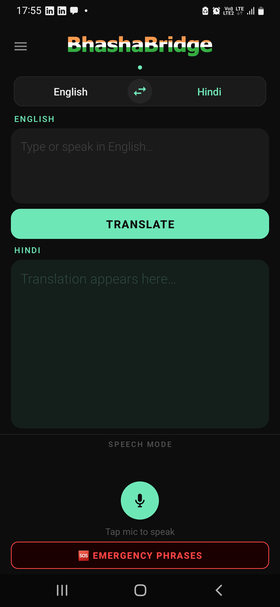
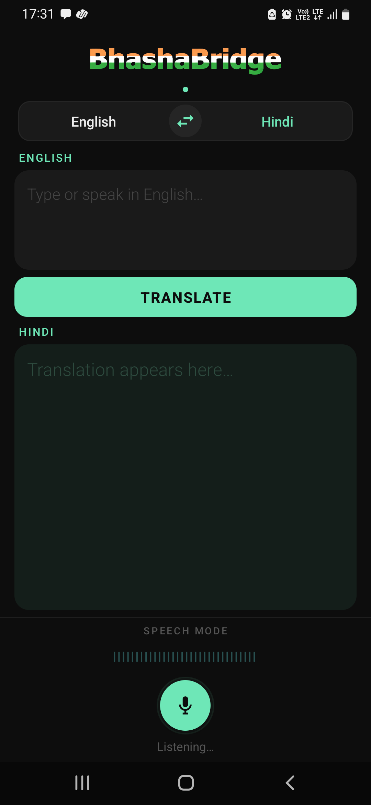
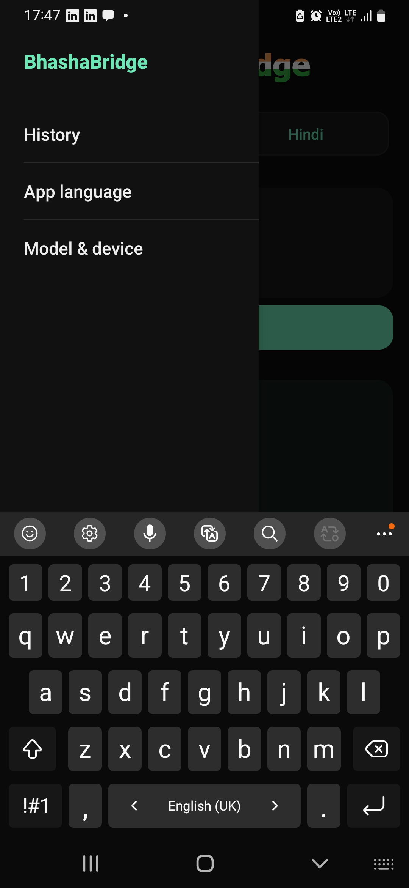
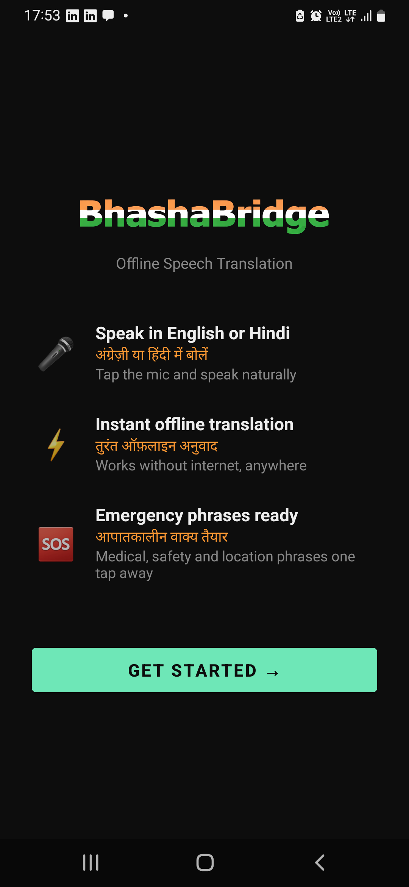

# UI Reconstruction (Phase 9)

V4 had a production-grade translation runtime and a "Hello World" screen. This phase rebuilt the
presentation layer so the app is feature-equivalent to v3.4.1, using v3.4.1 as a **behavioural
reference** rather than a source to copy.

The optimised backend was not touched. `git diff v4-runtime-complete..HEAD -- app/.../mt
app/.../bench model_pipeline docs` is empty for every runtime file: no `MtEngine`, `OnnxModels`,
`Decoder`, `Tokenizer`, `CpuCapabilities`, `ExecutionPolicy`, `Metrics`, quantization or export
change. The only pre-existing file that changed at all is `BhashaBridgeApp`, which gained ownership
of the Vosk models next to the MT engines it already owned.

## Architecture

```
MainActivity / WelcomeActivity        renders state, forwards taps
        │                             (no engine reference, no background work)
        ▼
TranslateViewModel                    owns direction, translation, speech session, history
        │                             single-thread MT dispatcher; state as one immutable snapshot
        ▼
BhashaBridgeApp                       process-scoped owner: MtEngine per Direction, VoskModels
        ▼
MtEngine → cached INT8 ONNX graphs    unchanged from Phase 8
```

Rules that held throughout:

- **No Activity or Fragment calls the runtime.** Neither Activity can reach an `MtEngine`; the only
  path is `TranslateViewModel` → `BhashaBridgeApp.translator(direction)`.
- **Native resources stay process-scoped.** The ViewModel borrows engines and Vosk models and never
  releases them — that is `onTrimMemory`'s job, and it is the structural fix for the v3.4.1 leak
  (LESSONS_FROM_V3 L2). It releases only what it owns: the MT dispatcher, the capture session, TTS.
- **One MT thread.** `MtEngine` is documented as one-translation-at-a-time and a cancelled coroutine
  cannot interrupt a blocking call already inside ONNX Runtime, so all MT work runs on a
  single-thread dispatcher. Overlap is impossible, not merely unlikely.
- **State is one immutable snapshot.** The Activity holds no UI state, so a rotation cannot lose or
  contradict it. High-rate signals (waveform level, transcripts) are separate `SharedFlow`s so a
  per-buffer amplitude cannot re-render the screen or fight the user's cursor.

## Features restored

| Feature | Status | Notes |
|---|---|---|
| Branding: logo, launcher icon, palette, theme | ✅ | v3.4.1 assets; one permanently-dark theme |
| Translation screen: language bar, swap, input, output | ✅ | EN→HI verified on device |
| Loading overlay with animated dots | ✅ | Covers the ONNX session load |
| Microphone capture, live waveform, pulse | ✅ | Verified on device |
| Vosk recognition (English, Hindi models) | ✅ | Model keyed by `Direction` |
| ASR correction tables | ✅ | Carried from v3.4.1 verbatim |
| Streaming translation of interim speech | ✅ | 3-word / 250 ms / changed-text gate |
| "Heard: …" raw-transcript hint | ✅ | Shown only when correction changed the text |
| Text-to-speech playback + missing-voice banner | ✅ | Hindi voice detected on the test device |
| Emergency phrases: 4 tabs, 32 pairs, replay | ✅ | Verified on device |
| Navigation drawer | ✅ | History, Import audio, App language, Model & device |
| Translation history | ✅ | 10 entries, in memory, recall on tap |
| App language (English / हिंदी) | ✅ | Per-app locales |
| Audio file import | ✅ | Verified by instrumented test on a real WAV |
| First-run onboarding + language setup | ✅ | Verified after `pm clear` |
| Microphone permission flow | ✅ | Granting resumes the tap that triggered it |
| Hindi UI strings (`values-hi/`) | ✅ | Actually used, unlike v3.4.1's |

## Intentional deviations from v3.4.1

Each of these is a decision, not an omission.

1. **UI language uses per-app locales, not a hand-tracked flag.** v3.4.1 stored a `ui_language`
   preference and re-applied ~40 inline `if (isHindi) "…" else "…"` pairs by hand; it shipped a
   `values-hi/strings.xml` it never read, so a new string could silently ship English-only. V4 puts
   every string in resources and calls `AppCompatDelegate.setApplicationLocales` once.

2. **One `WelcomeActivity` instead of `OnboardingActivity` + `SetupActivity`.** v3.4.1's onboarding
   Activity existed only to launch the setup Activity for a result and forward that result verbatim.
   The two pages are now a `ViewFlipper` — same flow, no result plumbing, no back stack.

3. **No setup-time TTS data prompt.** v3.4.1 fired `ACTION_CHECK_TTS_DATA`, which reports whether
   *any* voice data is installed, while its dialog spoke about Hindi specifically — so it could nag
   users who were fine and pass users who were not. The main-screen banner queries the Hindi voice
   itself and appears exactly when it is missing, with the same one-tap install action.

4. **Typed input is not auto-corrected.** v3.4.1 rewrote the user's typed text 1.5 s after they
   stopped typing, using the ASR correction tables. Those tables encode acoustic mis-hearings, which
   typed text does not contain, so the feature edited deliberate input to fix errors that were not
   there. Correction still runs on every recognised utterance, where it belongs.

5. **No storage permission.** Audio import uses `ActivityResultContracts.OpenDocument`, which grants
   access to the one file the user picked. v3.4.1 declared `READ_EXTERNAL_STORAGE`.

6. **A `Recognizer` is built per recording session, not held and rebuilt on swap.** A Vosk recogniser
   is bound to one model for life. v3.4.1 kept a long-lived one and rebuilt it on direction change,
   which is how its audio import ended up always using the English model (LESSONS_FROM_V3 L11). Here
   the session builds its own from the model it is about to use, so it cannot point at the wrong
   language.

7. **History holds 10 entries, not 5.** Still in memory only, still not persisted — this is a "what
   did I just say" affordance, and translated speech is exactly the content that should not outlive
   the session on disk.

8. **`values-night/` deleted.** The app has one design. v3.4.1's night variant overrode a base style
   nothing used.

## HI→EN is not available in this build

Swapping to Hindi→English reports *"Hindi → English model is not available in this build"* and stays
on the working direction. This is honest reporting of a real gap, not a UI defect: V4 ships only the
EN→HI cached INT8 graphs (`encoder_int8` / `decoder_init_int8` / `decoder_step_int8`). The HI→EN pair
has not been through the Phase 6A export + 6C quantization pipeline yet — the provenance gap already
recorded in `OPTIMIZATION_SUMMARY.md` §9. The UI, the ViewModel, the tokenizer and `OnnxModels` all
already handle the direction; only the asset is missing.

The Hindi *speech* model (`model-hi`) is present, so the Hindi recogniser loads.

## Verification

Everything below ran on the SM-M315F (Exynos 9611, Android 12) — the same device as every benchmark
in this project. Each commit was built and installed before being committed.

| Check | Result |
|---|---|
| Typed EN→HI translation | "how are you" → "आप कैसे हैं ?", 368 ms (encoder 58 ms, decode 296 ms, 4 tokens) |
| Typed EN→HI translation | "I need water" → "मुझे पानी चाहिए ।", 371 ms |
| Swap to HI→EN | Reports unavailable, stays on EN→HI, no crash |
| Microphone session | Model loads, Listening state, live waveform, pulse, clean close |
| Emergency sheet | Opens on Basic, tabs render, phrase selects + speaks, Back closes |
| Emergency → main screen | Selected pair lands on the translation screen |
| Drawer | Opens; all four items wired |
| History | Lists the translation, recalls it into input + output on tap |
| Model & device | Reports `ARMv8.0 cores=8(perf=4,eff=4)`, `arm-adaptive(threads=2)`, arena false |
| First run (after `pm clear`) | Tour → language → main screen; second launch skips it |
| Audio import | `AudioFileTranscriberTest` 1/1 — real 16 kHz WAV decoded through Vosk, "water" recognised |
| Backend regression | `MtEngineInstrumentedTest` 2/2 pass, unchanged |
| Backend diff | Empty for `mt/`, `bench/`, `model_pipeline/`, `docs/` since `v4-runtime-complete` |

### Screenshots

| | |
|---|---|
|  |  |
| Translation screen | Recording, live waveform |
|  |  |
| Emergency sheet with a phrase selected | Navigation drawer |
|  | |
| First-run tour | |

## Remaining UI work

- **Speech accuracy is unmeasured.** Microphone capture, recognition wiring and the file path are
  verified, but no word-error rate was measured against a human voice — the file test uses
  synthesised speech and asserts that recognition happened, not how well.
- **HI→EN end-to-end** cannot be exercised until those cached graphs are exported (backend work,
  out of scope for this phase).
- **No landscape or tablet layout.** The screen is portrait-first, as v3.4.1 was.
- **Streaming partials are not shown in the input field** during audio-file import; only the final
  transcript is. Live microphone input behaves the same way as v3.4.1 here.
- **Accessibility beyond content descriptions** (font scaling at extreme sizes, TalkBack traversal
  order) has not been audited.
